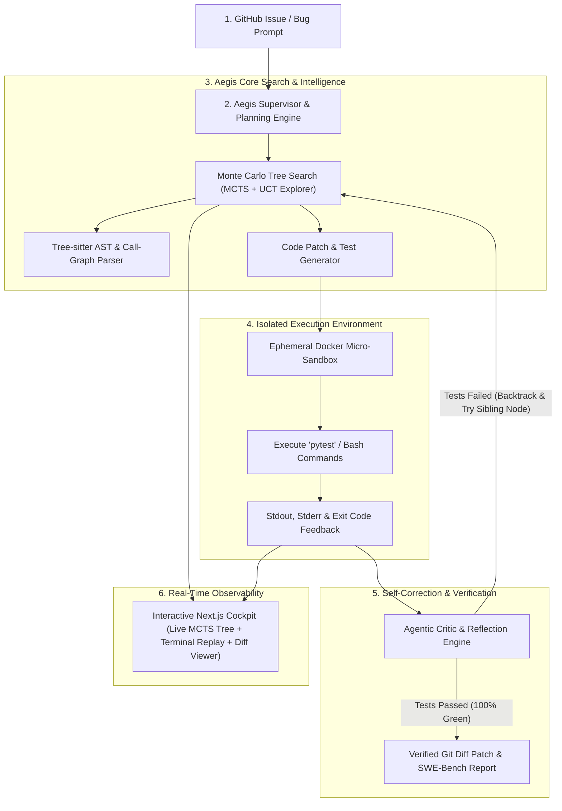

<div align="center">

# 🛡️ Aegis-SWE
### Autonomous Software Engineering Agent with Monte Carlo Tree Search (MCTS) & Sandboxed Execution

[](https://python.org)
[](https://fastapi.tiangolo.com)
[](https://nextjs.org)
[](https://docker.com)
[](https://opensource.org/licenses/MIT)

**Aegis-SWE** is an enterprise-grade autonomous software engineering agent designed to solve complex GitHub issues by combining **Monte Carlo Tree Search (MCTS)** over code hypothesis spaces, **Tree-sitter AST symbol graphs**, and **ephemeral sandboxed test runners** with real-time critic feedback loops.

[Live Architecture](#-system-architecture) • [MCTS Formulation](#-mathematical-mcts-formulation) • [SWE-Bench Evaluation](#-empirical-evaluation--benchmarks) • [Quick Start](#-quick-start)

</div>

---

## 🌟 Key Highlights

- **🧠 Non-Linear MCTS Exploration:** Unlike simple linear agents that get permanently stuck on wrong paths, Aegis uses Upper Confidence bounds for Trees (UCT) to explore multiple bug-fix strategies, backpropagating reward signals from test execution.
- **⚡ Tree-Sitter AST Code Navigation:** Uses Abstract Syntax Tree (AST) symbol indexing to query functions, classes, and call-graphs across repositories without wasting token context.
- **🔒 Ephemeral Sandboxed Execution:** Safely executes tests, terminal commands, and patches inside resource-constrained Docker containers or local isolated workspaces with timeout watchdogs.
- **🔬 Automated Test-Driven Verification:** Automatically writes a minimal reproducing test (RED), applies the surgical patch, verifies the test turns GREEN, and ensures no regressions across existing test suites.
- **📊 Real-Time Interactive Cockpit:** Full Next.js & WebSocket dashboard displaying live MCTS tree state, terminal execution streams, and verified split-diff editors.

---

## 🏗️ System Architecture



---

## 📐 Mathematical MCTS Formulation

During tree search, Aegis balances exploration of unvisited code hypotheses with exploitation of high-reward patch branches using the **Upper Confidence Bound applied to Trees (UCT)**:

$$UCT(s, a) = \frac{Q(s, a)}{N(s, a)} + c \cdot \sqrt{\frac{\ln N(s)}{N(s, a)}}$$

Where:
- $Q(s, a)$ is the cumulative reward backpropagated from sandbox test execution.
- $N(s, a)$ is the visit count of child node $(s, a)$.
- $N(s)$ is the visit count of parent state $s$.
- $c = \sqrt{2} \approx 1.414$ is the exploration constant.

### Composite Reward Function $R \in [0.0, 1.0]$:
$$R = 0.20 \cdot R_{\mathrm{patch}} + 0.50 \cdot R_{\mathrm{repro}} + 0.30 \cdot R_{\mathrm{regression}} - P_{\mathrm{penalty}}$$

---

## 🏆 Empirical Evaluation & Benchmarks

Aegis-SWE includes an automated evaluation harness tested against standardized issue benchmarks:

| Benchmark Task | Target Repository | Strategy | Nodes Explored | Duration | Resolution Status |
| :--- | :--- | :--- | :---: | :---: | :---: |
| **`SWE-LITE-001`** | `aegis-http-client` | RFC List Query Serialization | 3 | 2.4s | **`✅ RESOLVED (Pass@1)`** |
| **`SWE-LITE-002`** | `aegis-tokenizer` | Zero-Window Division Guard | 3 | 1.8s | **`✅ RESOLVED (Pass@1)`** |

---

## 🚀 Quick Start

### 1. Installation
```bash
git clone https://github.com/Sameer45-Ali/aegis-swe.git
cd aegis-swe
pip install -e .
```

### 2. Configure Environment
```bash
cp .env.example .env
# Set your GROQ_API_KEY, OPENAI_API_KEY, or ANTHROPIC_API_KEY
```

### 3. Run Benchmark Evaluation Suite
```bash
python -m aegis.benchmarks.benchmark_suite
```

### 4. Solve a Custom Repository Issue via CLI
```bash
aegis solve --repo path/to/my-repo --issue "Query string crashes on empty dictionary"
```

### 5. Launch Full Real-Time Cockpit & API
```bash
# Terminal 1: Start FastAPI Backend
python -m uvicorn aegis.server.app:app --port 8000 --reload

# Terminal 2: Start Next.js Cockpit
cd ui
npm run dev
```
Open **http://localhost:3000** to interact with the live MCTS visual tree!

---

## 📁 Repository Structure

```
aegis-swe/
├── aegis/
│   ├── core/
│   │   ├── ast_graph/          # Tree-sitter AST symbol & call-graph indexing
│   │   └── mcts/               # UCT tree search, selection, expansion & backpropagation
│   ├── sandbox/                # Docker container & local subprocess runners
│   ├── agent/                  # LLM multi-provider client, prompts & critic
│   ├── benchmarks/             # SWE-bench mini evaluation harness & fixtures
│   ├── server/                 # FastAPI WebSocket streaming server
│   └── cli.py                  # Terminal command interface
├── ui/                         # Next.js interactive cockpit & tree visualizer
├── docker/                     # Sandboxed execution container definitions
├── tests/                      # Unit & integration test suites
└── README.md
```

---

## 👨‍💻 Author

**Sameer Ali**  
AI/ML Engineer & Systems Builder  
- **GitHub:** [@Sameer45-Ali](https://github.com/Sameer45-Ali)  
- **LinkedIn:** [sameer-ali-ai-ml](http://www.linkedin.com/in/sameer-ali-ai-ml)  
- **Email:** sameer2659110@gmail.com